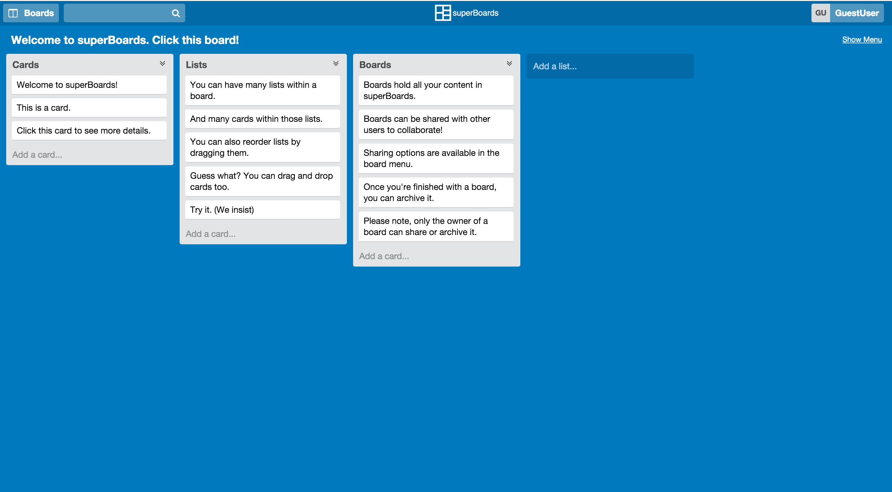

## superBoards

[Live Site][site]

[site]: http://www.superboards.xyz

<!--  -->

superBoards is a web application inspired by Trello built using Ruby on Rails and React.js.

 <!-- 2. Some discussion of the technical achievements. Think of it as an expansion of the bullets in your resume -->

• Implements drag-and-drop functionality using React DnD.
• Allows secure authentication using BCrypt and Omniauth with Facebook.
• Enables full text search through user’s data with PgSearch.

<!-- - Create an account
- Log in / Log out
- Create, read, edit, and delete boards
- Create, read, edit, and delete lists
- Create, read, edit, and delete cards
- Create, read, edit, and delete comments on cards
- Organize cards and lists within boards
- Share boards with other members
- Search through cards for blocks of text -->
